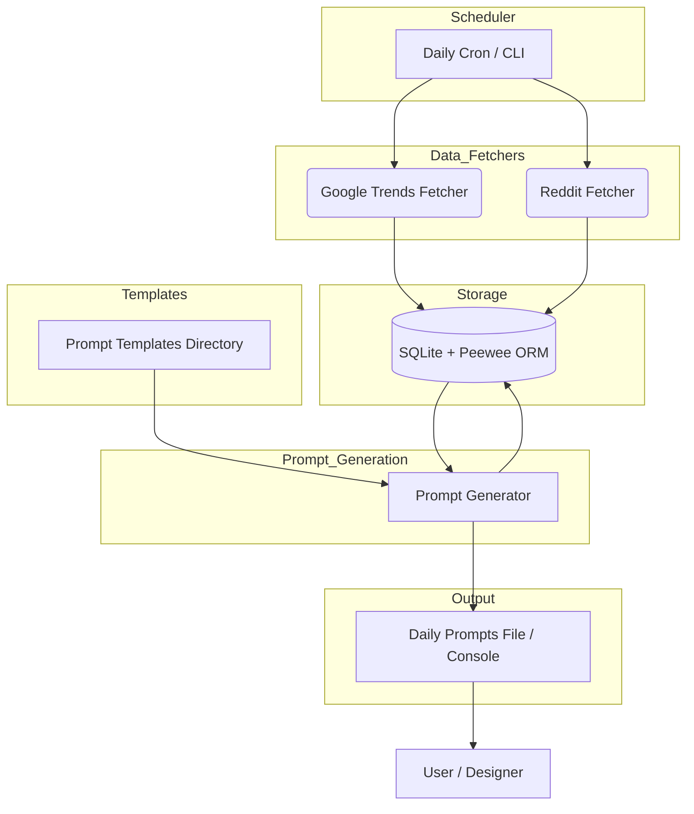

# AI-Driven T-Shirt Design Prompt Generator – System Design

## 1. Overview
This document describes the end-to-end design of a daily service that discovers trending topics (Google Trends + Reddit) and converts them into Midjourney-ready prompts for a T-shirt business. The design emphasizes modularity, ease of extension, and zero-ops local execution.

## 2. Goals & Non-Goals
* **Goals**
  * Fully automated, once-per-day run to fetch U.S. trends in six starter niches (AI Art, Food & Drink, Wellness, Pets, Nostalgia '80-'90s, Plants).
  * Generate prompt text via reusable template files and persist both source trends and final prompts.
  * One-command execution under Poetry with minimal external dependencies.
* **Non-Goals** – no real-time streaming, artwork generation, e-commerce storefront, or multi-user web UI (future work).

## 3. High-Level Architecture


## 4. Component Breakdown
### 4.1 Scheduler / Entry Point (`run_daily.py`)
* Executed via `poetry run python run_daily.py` or cron.
* Loads configuration (YAML/JSON) of niches, subreddits, and Google keywords.
* Sets up DB connection and orchestrates fetchers & generator.

### 4.2 GoogleTrendsFetcher
* Wraps PyTrends `TrendReq(hl="en-US", geo="US")`.
* Modes: daily trending searches and niche-specific rising queries.
* Normalizes into `TrendTopic` rows; retries with exponential back-off.

### 4.3 RedditFetcher
* Thin PRAW client (read-only) using app creds from `.env`.
* Pulls top N posts from each configured subreddit in the last 24 h.
* Extracts cleansed topic text from titles and stores as `TrendTopic` rows.

### 4.4 Persistence Layer (SQLite + Peewee)
* **Models**
  * `TrendTopic(id, source, niche, topic_text, timestamp, metadata_json)`
  * `Prompt(id, niche, topic_text, prompt_text, created_at)`
* Batch inserts and unique index on `(source, topic_text, date)` prevent duplicates.

### 4.5 Template Manager
* Reads `.txt` files in `prompt_templates/` and caches for run duration.
* Supports multiple templates per niche via naming (`plants_1.txt`, etc.).

### 4.6 PromptGenerator
* Queries today's new `TrendTopic`s, selects up to *M* per niche.
* Chooses template (round-robin/random) and substitutes `{topic}` placeholder.
* Inserts resulting text into `Prompt` table.

### 4.7 Output Writer
* Writes `output/prompts_YYYY-MM-DD.txt` grouped by niche.
* Echoes same list to stdout.

### 4.8 Logging & Error Handling
* Stdlib `logging` with rotating files (`logs/run_YYYY-MM-DD.log`).
* Decorator-based retry for network calls; non-recoverable errors exit non-zero for cron monitoring.

## 5. Data Flow Sequence
1. Scheduler starts CLI script.
2. Fetchers retrieve data → bulk-insert `TrendTopic` rows.
3. PromptGenerator pulls topics → generates prompts → inserts `Prompt` rows.
4. Output Writer produces daily file; script exits.

## 6. Database Schema (SQL DDL)
```sql
CREATE TABLE trend_topic (
  id INTEGER PRIMARY KEY AUTOINCREMENT,
  source TEXT NOT NULL,          -- 'Google Trends' | 'Reddit'
  niche  TEXT NOT NULL,
  topic_text TEXT NOT NULL,
  timestamp DATETIME NOT NULL,
  metadata_json TEXT,
  UNIQUE(source, topic_text, date(timestamp))
);

CREATE TABLE prompt (
  id INTEGER PRIMARY KEY AUTOINCREMENT,
  niche TEXT NOT NULL,
  topic_text TEXT NOT NULL,
  prompt_text TEXT NOT NULL,
  created_at DATETIME NOT NULL DEFAULT CURRENT_TIMESTAMP
);
```

## 7. Configuration File Example (`config/niches.yml`)
```yaml
niches:
  pets:
    google_keywords: ["pets", "cats", "dogs"]
    subreddits: ["pets", "aww"]
    templates: ["pets_1.txt", "pets_2.txt"]
    max_prompts_per_day: 3
  food_drink:
    google_keywords: ["food", "recipes"]
    subreddits: ["food", "FoodPorn"]
    templates: ["food_realistic.txt", "food_cartoon.txt"]
```

## 8. Operational Concerns
* **Local dev** – `poetry install`; store Reddit creds in `.env`.
* **Scheduling** – `0 7 * * * cd /path/ai-design && poetry run python run_daily.py`.
* **Back-ups** – copy SQLite file to `backups/` after run.
* **Observability** – log counts: topics fetched, prompts generated, runtime.

## 9. Extensibility
1. **Add a niche** – new YAML entry + template files; no code change.
2. **New data source** – implement `BaseFetcher` interface; register in scheduler.
3. **DB migration** – swap Peewee SQLite → Postgres with minimal changes.
4. **Web UI** – later expose Flask/FastAPI endpoints using same models.

## 10. Security & Compliance
* Reddit API used within rate limits; user-agent identifies bot.
* PyTrends is unofficial; back-off to avoid IP bans.
* No PII stored; local SQLite file.

## 11. Testing Strategy
* **Unit** – mock PyTrends/PRAW, assert DB writes & prompt rendering.
* **Integration** – run against test subreddits/keywords, verify output file.
* **CI** – GitHub Actions matrix (macOS & Ubuntu) running `pytest` + `ruff`.

## 12. Future Enhancements
* GPT-driven prompt paraphrasing for more variety.
* Duplicate-detection across days.
* Slack/email notification with file attachment.
* Docker image + Terraform job for cloud scheduling.

---
© 2025 AI-Design Project 